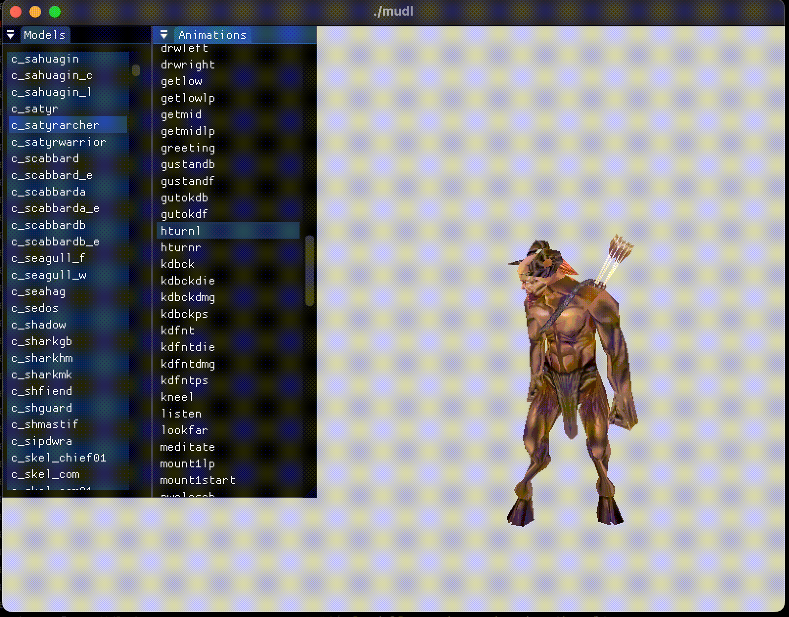
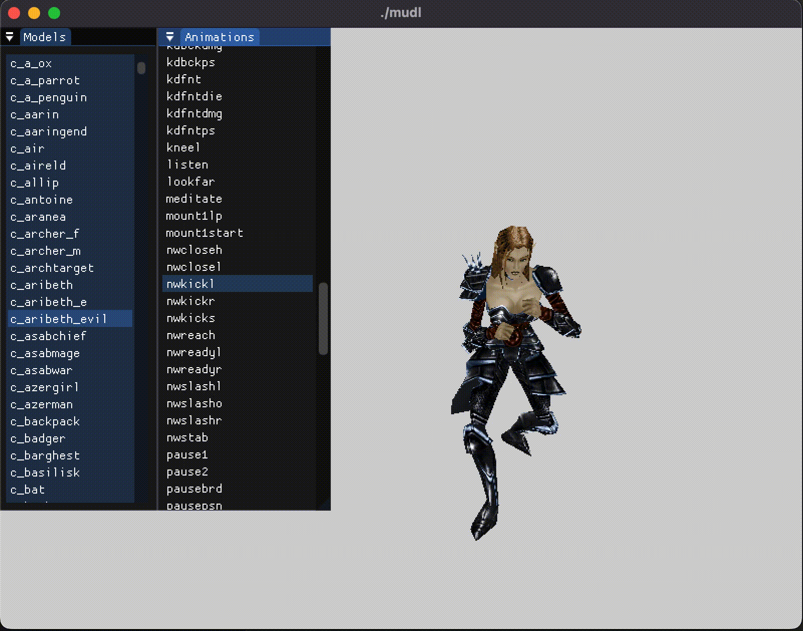
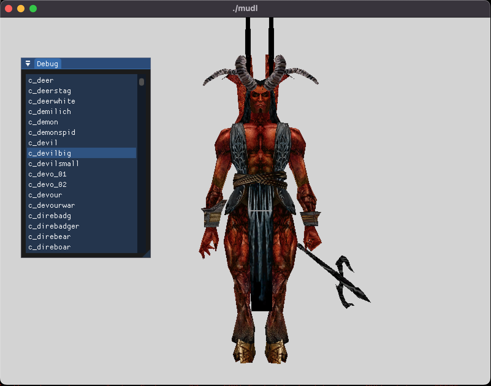
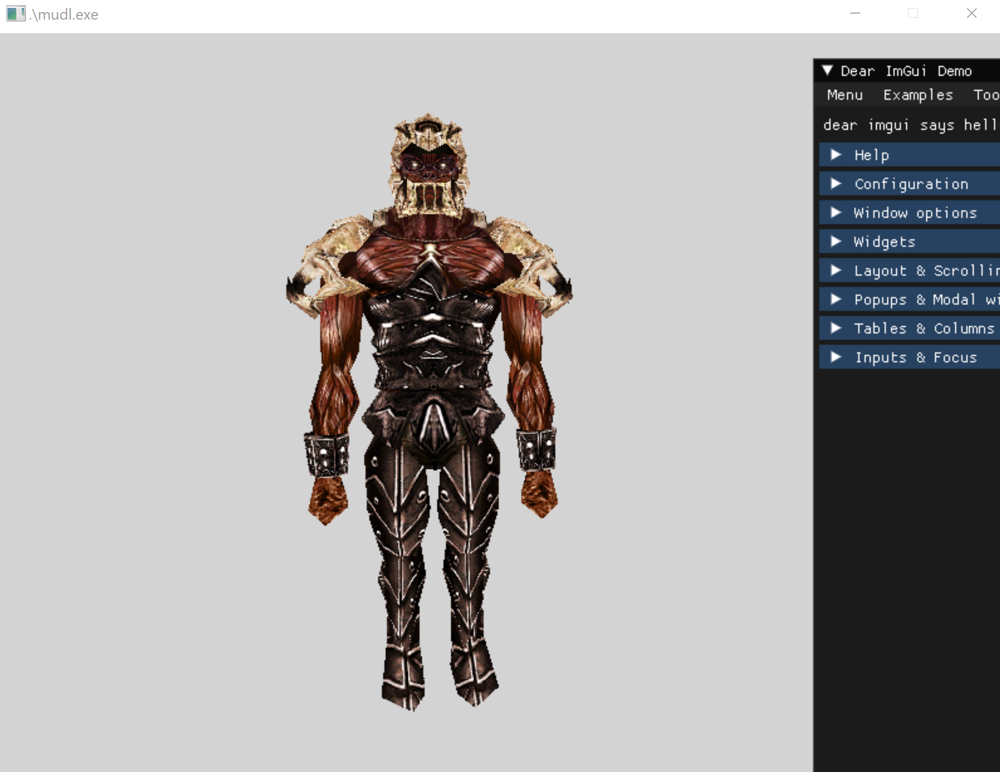

# mudl

Hackish proof of concept model viewer for NWN Models..  mdl + having only muddled through a couple chapters of graphics book = **mudl**.  See also the opengl branch for an openGL 3.3 (what the game uses) version.

## Building

Install [vcpkg](https://github.com/microsoft/vcpkg) - see the **Getting Started** section.

```
$ git clone --recurse-submodules https://github.com/jd28/mudl.git
$ cmake --preset=<macos|linux|windows>
$ cmake --build --preset defaul
```

Build the shaders macOS/Metal, Linux/OpenGL/Vulkan:
```
$ ./build-shaders.sh
```

Build the shaders windows dx11/12:
```
$ .\build-shaders.ps1
```

```
cd bin/
./mudl <command> <model>
```

where model is a model without extension: i.e. 'c_aribeth'

## Usage

Model Viewer:
```
./mudl
```

Model Tools
```
./mudl [<command>] [<model>]

Commands
--------
    extract     Extracts a model and its corresponding textures, material, txi files (maybe)
```

**mudl** should be able to find your NWN install and user directory.  If not set the
env vars ``NWN_ROOT`` and ``NWN_USER`` to game installation and user home directory,
respectively.

## Limitations

- This is limited to fairly basic models from the 1.69, which is basically all the ones that come
  with NWN:EE
- Skinmesh animation works for some models, but not others
- No emitters, danglymesh, etc.
- Only basic animations are supported, and from compiled models.  ASCII model animations need a fix in the
  core library. No LERPing, screenshot below is much slower than actual.
- No plt textures.. on the opengl branch there was a test that seems like it can get the layers right, but
  the colors are wrong

# Screens

## macOS - Metal - Skinned Animation


## macOS - Metal - Some Animations and a Boot to your Face


## macOS - Metal - Model Selector


## macOS - Metal - Dire Tiger (No Toenails)


## Linux - Vulkan - Evil Aribeth (Some HIDPI Issues)


## Windows - DirectX 12 - Doom Knight


# Tech
- bgfx
- Dear imgui
- sdl2
- glm
- rollnw
