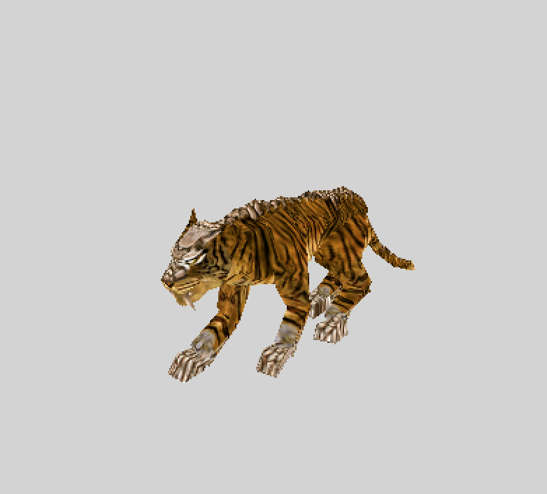
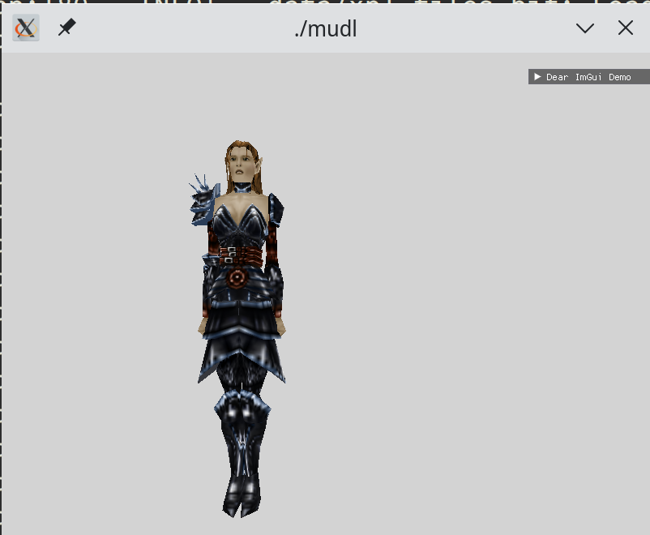

# mudl

Hackish proof of concept model viewer for NWN Models..  mdl + having only muddled through a couple chapters of graphics book = **mudl**.

## Building

Install [vcpkg](https://github.com/microsoft/vcpkg) - see the **Getting Started** section.

```
$ git clone --recurse-submodules https://github.com/jd28/mudl.git
$ cmake --preset=<macos|linux|windows>
$ cmake --build --preset defaul
```

Build the shaders macOS/Metal, Linux/OpenGL/Vulkan:
```
$ ./build-shaders.sh
```

```
cd bin/
./mudl <command> [<args>]
```

## Usage

```
mudl <command> [<args>]

Commands
--------
    extract     Extracts a model and its corresponding textures, material, txi files (maybe)
    view        Open a model for viewing
```

**mudl** should be able to find your NWN install and user directory.  If not set the
env vars ``NWN_ROOT`` and ``NWN_USER`` to game installation and user home directory,
respectively.

## Limitations

- This is limited to fairly basic models from the 1.69, which is basically all the ones that come
  with NWN:EE
- No emitters, danglymesh, skinmesh, etc.

# Screens

## macOS - Metal - Dire Tiger (No Toenails)


## Linux - Vulkan - Evil Aribeth (Some HIDPI Issues)


# Tech
- bgfx
- Dear imgui
- sdl2
- glm
- rollnw
